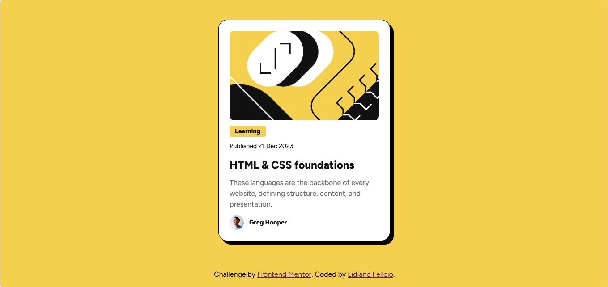

# Frontend Mentor - Blog Preview Card

## 📸 Screenshot

This is a solution to the **Blog Preview Card** challenge from Frontend Mentor. The goal of this project was to build a responsive card component and match the design as closely as possible.

---

## 📌 Overview

### 🧩 The challenge

Users should be able to:

* View the optimal layout depending on their device's screen size
* See hover and focus states for all interactive elements

---

## 🔗 Links

* Solution URL: https://www.frontendmentor.io/profile/lidianofeliciobr
* Live Site URL: https://seuusuario.github.io/blog-preview-card/

---

## 🛠️ Built with

* Semantic HTML5
* CSS
* Flexbox
* Mobile-first workflow

---

## 📚 What I learned

During this project, I learned and practiced:

* How to structure a semantic HTML layout
* How to use Flexbox for layout and alignment
* How to apply spacing using `gap` and `padding`
* How to inspect and replicate design values from Figma
* How to create hover and focus states
* How to make a layout responsive (including small devices like iPhone SE)

---

## 🚀 Continued development

In future projects, I want to focus on:

* Improving responsive design skills
* Writing cleaner and more maintainable CSS
* Enhancing accessibility (focus states and semantics)

---

## 👨‍💻 Author

* GitHub: https://github.com/lihsousa
* Frontend Mentor: https://www.frontendmentor.io/profile/lidianofeliciobr

---

## 🙌 Acknowledgments

Thanks to Frontend Mentor for providing this challenge and helping me improve my frontend skills.
